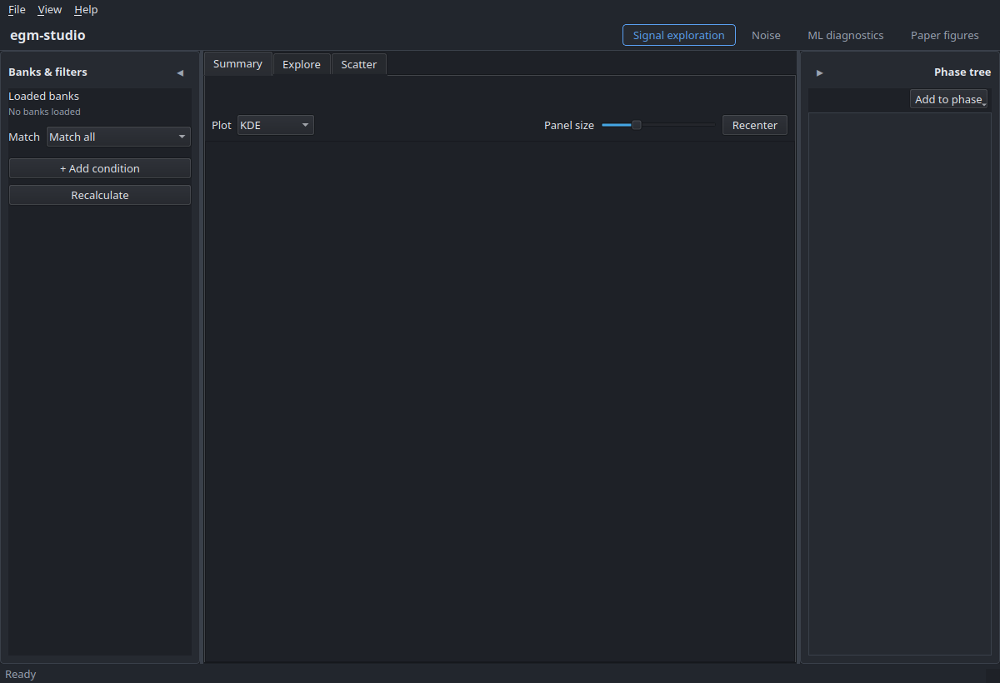
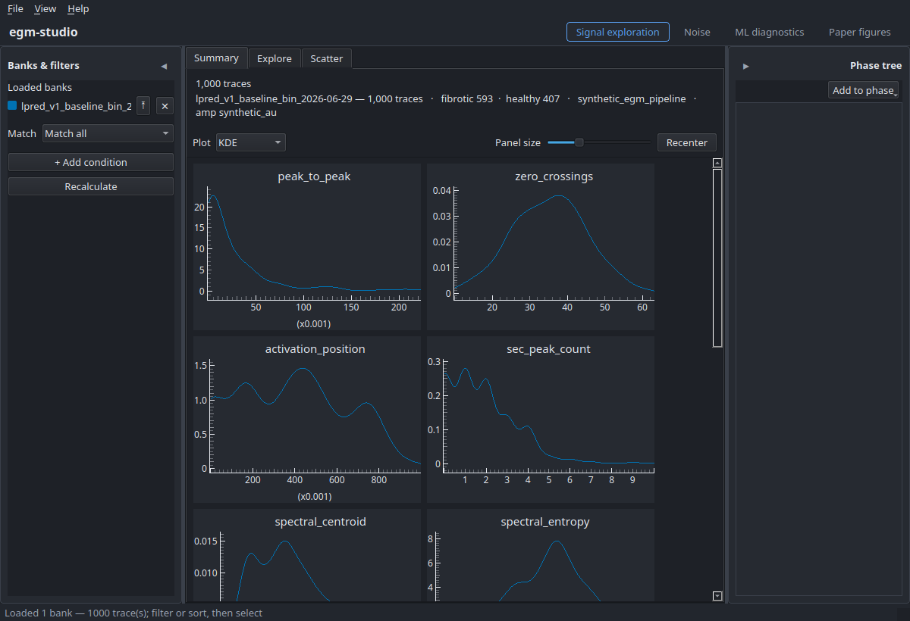

# egm-studio — user manual

**What this is:** the full user guide to the egm-studio desktop app — how to launch
it, work through each of the four modes, read every figure, save your work, and
render figures headlessly.

**Who it's for:** someone using egm-studio to explore intracardiac-EGM banks and
produce paper figures. For a from-scratch developer setup (editable install, sibling
pins, tests) see [getting-started.md](getting-started.md); for the math behind the
figures see [theory.md](theory.md).

**Status:** 🚧 **scaffold** (Block 13, in progress). Section structure + screenshot
slots are in place; prose is being filled in. Sections marked _TODO_ are not written
yet.

> **On the screenshots.** Slots below look like this:
>
> > 📸 **`screenshots/NN-name.png`** — _capture:_ what the image should show.
>
> Drop the captured PNG into [`screenshots/`](screenshots/) under that name, then
> uncomment the `![...]` line beneath the slot. Naming + sizing conventions live in
> [`screenshots/README.md`](screenshots/README.md).

---

## 1. Install & first launch

_Covers: the one-line install, launching the app, and what you see the first time._
Install detail lives in [getting-started.md](getting-started.md); this section is the
short version + the first-run orientation.

```bash
pip install myocard-egm-studio   # then:
egm-studio
```

> 📸 **`screenshots/01-first-launch.png`** — _capture:_ the app immediately after
> launch (empty state), showing the four-mode segmented control in the header and
> the left/right sidebars.
<!--  -->

_TODO: prose — the empty state, picking a theme, where Settings live._

## 2. Orientation — the shell

_Covers: the persistent layout every mode shares, so the mode sections below can
refer to "the left sidebar" / "the Phase rail" without re-explaining._

- **Header** — the four-mode segmented control (Signal exploration · Noise · ML
  diagnostics · Paper figures) + theme toggle.
- **Left sidebar** — mode-driven: loaded banks & filters (most modes) or the noise
  controls (Noise mode). Collapses to an icon strip.
- **Main work area** — one or two columns; the active mode's view.
- **Right rail** — the Phase artifact tree + scratch (see §6). Collapses.
- **Menu bar** — File (Open/Save), View (theme, sidebars), Settings.

> 📸 **`screenshots/02-shell-overview.png`** — _capture:_ a loaded session with all
> regions visible; annotate the header, left sidebar, main area, and right rail.
<!--  -->

_TODO: prose + annotation callouts._

---

## 3. The four modes

Each mode below follows the same shape: **what it's for → open something → the
walkthrough → what to look for.** The as-built click-throughs in
[`../project/user_flow_walkthroughs.md`](../project/user_flow_walkthroughs.md) are the
source these expand on.

### 3.1 Signal exploration

_What it's for: filter and inspect EGM traces from one or more loaded banks._
Tabs: **Summary · Explore · Scatter.**

Walkthrough (to expand):

1. **File ▸ Open bank** → a classifier bank (`.h5`). Lands on **Summary**.
2. **Summary** — trace count, class balance, the 11-panel feature-distribution grid.
   Opening a second bank overlays it.
3. **Explore** — compose a filter (feature / metadata / source), sort the result
   table, click a row for the detail pane.
4. **Compare** — _Find similar in other source_ → source-first 3-pane compare with
   per-feature deltas.
5. **Scatter** — 2-D feature scatter colored by source; click a point → detail.

> 📸 **`screenshots/03-signal-summary.png`** — _capture:_ Summary tab with two banks
> loaded, the 11-panel KDE grid overlaid + legend.
> 📸 **`screenshots/04-signal-explore.png`** — _capture:_ Explore tab mid-filter — the
> filter panel with a condition set + the sorted result table.
> 📸 **`screenshots/05-signal-compare.png`** — _capture:_ the 3-pane compare with delta
> annotations.
> 📸 **`screenshots/06-signal-scatter.png`** — _capture:_ the Scatter tab, points
> colored by source.

_TODO: prose for each step; what a "good" bank summary looks like._

### 3.2 Noise

_What it's for: browse the raw IAFDB noise segments of a noise bank._ A noise bank is
raw segments, not the loaded-bank view-model, so it gets its own mode.

Walkthrough (to expand): right-click a noise bank in the Phase tree ▸ **View noise
segments** (or open one) → record/channel filters + segment table → select a segment
to plot it (aspect-capped).

> 📸 **`screenshots/07-noise-mode.png`** — _capture:_ Noise mode — left-rail controls +
> segment table + a selected segment plotted.

_TODO: prose._

### 3.3 ML diagnostics

_What it's for: compare model runs over an evaluated predictions bank._ Tabs:
**Output · Metrics · Training · Explore.** Populated automatically when an opened bank
carries predictions (no separate "load evaluated bank" step).

Walkthrough (to expand):

1. **Open bank** (predictions bank) and/or **File ▸ Open training run** (`run.json`).
2. **Output** — P(positive) histogram per source; overlays across runs.
3. **Metrics** — ROC / confusion / calibration (only when truth labels are present).
4. **Training** — loss + metric curves vs epoch, per run.
5. **Explore** — filter to failures (FP/FN) and find each one's nearest correct
   counterpart.

> 📸 **`screenshots/08-ml-output.png`** — _capture:_ Output tab, two runs overlaid.
> 📸 **`screenshots/09-ml-metrics.png`** — _capture:_ Metrics tab — ROC + confusion +
> calibration.
> 📸 **`screenshots/10-ml-training.png`** — _capture:_ Training tab, train vs val.
> 📸 **`screenshots/11-ml-explore.png`** — _capture:_ Explore tab filtered to failures
> with a pair comparison open.

_TODO: prose; note the IAFDB "no metrics, qualitative only" case._

### 3.4 Paper-figure prep

_What it's for: edit a figure spec beside a live preview, then render._ Split view:
curated spec form (left) + live WYSIWYG preview (right, a raster of the real recipe).

Walkthrough (to expand): pick a template (recipe) → fill the form (data sources,
features, styling) → the preview re-renders (debounced; Refresh for heavy recipes) →
**Render full** writes to the spec's `output.path`.

> 📸 **`screenshots/12-figure-prep.png`** — _capture:_ the split view — spec form on
> the left, live preview on the right.

_TODO: prose; the preview == export guarantee; the Phase-tree Generate/Regenerate
lifecycle._

---

## 4. Reading each figure

_Covers: how to interpret each of the eight paper-figure recipes — what it shows, and
how to tell a good result from a bad one. The **math** behind each lives in
[theory.md](theory.md); this section is the visual-interpretation half._

For each recipe: **what it shows · how to read it · good vs. bad.** Example renders can
be generated with `egm-studio-render <spec>.json` (these are figure outputs, not GUI
screenshots).

- **prediction-histogram** — _TODO._
- **feature-distribution-overlay** — _TODO._
- **bar-chart-with-deltas** — _TODO._
- **roc-curve-multi-line** — _TODO._
- **calibration-reliability-diagram** — _TODO._
- **trace-pair-gallery** — _TODO._
- **summary-table** — _TODO._
- **training-curve** — _TODO._

_(Migrated from theory.md §5, which was removed 2026-07-01 to keep the theory doc pure
math — Daniel's call. Cross-link each entry back to its theory.md derivation.)_

---

## 5. Saving your work

_Covers: capturing observations and figures into a phase (or scratch), and the Phase
artifact tree._ The user-facing walk-through already lives in
[saving_work.md](saving_work.md) — this section is the screenshot-illustrated version;
keep them in sync rather than duplicating.

- **Save observation** (File ▸ Save observation) — prose + snapshot of the view;
  reopen to reload the view.
- **Save a figure** (Flow C **Save into…**).
- **Phase tree + scratch** — the right rail; **Add to phase** / **Remove from phase**;
  **Promote to phase** from scratch.

> 📸 **`screenshots/13-save-observation.png`** — _capture:_ the Save-observation dialog.
> 📸 **`screenshots/14-phase-tree.png`** — _capture:_ the Phase tree with artifacts +
> status dots; a scratch item below.

_TODO: prose; point to saving_work.md for the full model._

---

## 6. Headless rendering (`egm-studio-render`)

_Covers: reproducing any figure from its spec, no GUI._ Short version here; the CLI is
also covered in [getting-started.md](getting-started.md#rendering-figures-from-the-cli).

```bash
egm-studio-render fig_prediction_histogram.json --phase path/to/phase/
egm-studio-render fig_prediction_histogram.json --banks banks.json -o figure.pdf
```

_TODO: the spec anatomy, `--phase` vs `--banks`, `--overwrite`, exit codes._

---

## 7. Keyboard shortcuts & navigation

_Covers: how to drive the app from the keyboard/mouse._

> **Note:** egm-studio v0.1 defines **no custom keyboard shortcuts** — only standard
> menu accelerators and pyqtgraph's built-in plot navigation. This section documents
> those; a curated shortcut set is a candidate for a later version.

- **Menus** — standard OS accelerators (File, View, Settings).
- **Plots (pyqtgraph)** — drag to pan, scroll to zoom, right-drag to scale one axis,
  right-click for the view menu / auto-range.

_TODO: confirm + tabulate the plot interactions; decide whether to add app shortcuts
before v0.1.0._

---

## 8. Troubleshooting / FAQ

_Covers: the handful of things that trip people up._ Scaffolded from known issues;
expand as real questions surface.

- **The app won't start on Linux (Qt libraries).** → the `libegl1 libgl1
  libxkbcommon0 libdbus-1-3` system deps; see
  [getting-started.md](getting-started.md#prerequisites).
- **No display / headless.** → figures render via the CLI without a display;
  `QT_QPA_PLATFORM=offscreen` for the GUI tests.
- **A large bank is slow the first time.** → feature extraction is the cost; the
  tiered cache makes re-opens fast. Ceiling + **Flush cache** live in Settings.
- **A figure won't render / an id won't resolve.** → _TODO._
- **An artifact shows amber "unresolved" in the Phase tree.** → its referenced ids
  aren't resolvable in scope; _TODO_ expand.

_TODO: fill from real usage._

---

## Where to go next

- [getting-started.md](getting-started.md) — install, run, test, the dev loop.
- [saving_work.md](saving_work.md) — the save / phase / scratch model.
- [theory.md](theory.md) — the math behind the figures.
- [../project/architecture.md](../project/architecture.md) — how the app is built.
