# egm-studio — user manual

**What this is:** the full user guide to the egm-studio desktop app — how to launch
it, work through each of the four modes, read every figure, save your work, and
render figures headlessly.

**Who it's for:** someone using egm-studio to explore intracardiac-EGM banks and
produce paper figures. For a from-scratch developer setup (editable install, sibling
pins, tests) see [getting-started.md](getting-started.md); for the math behind the
figures see [theory.md](theory.md).

**Status:** complete for v0.1 — the four modes, the per-figure reading guide, the save
flow, the headless-render reference, and troubleshooting are all written. Sections marked
as such will grow as features land and real questions surface.

---

## 1. Install & first launch

Install the package and launch the app:

```bash
pip install myocard-egm-studio   # then:
egm-studio
```

(Developer setup — editable install, sibling git pins, the test suite — is in
[getting-started.md](getting-started.md).)

The app opens on the **Signal exploration** mode with an empty work area. The
segmented control in the header switches between the four modes; both side rails
start empty and fill in as you load data. There's nothing to configure to get
going — open a bank (§3.1) and you're working.

<a href="screenshots/01-first-launch.png"></a>

Preferences — the colour theme, the scratch folder, and the view-model cache ceiling
— live under **File ▸ Settings** and persist across launches. The default is the dark
theme shown throughout this manual.

## 2. Orientation — the shell

Every mode shares one layout, so it's worth naming the regions once:

<a href="screenshots/02-shell-overview.png"></a>

- **Header** — the mode switcher (Signal exploration · Noise · ML diagnostics · Paper
  figures) and the theme toggle.
- **Left rail** — mode-driven. In most modes it's **Banks & filters** (the loaded
  banks + the filter builder); in Noise mode it becomes the noise controls. It
  collapses to a thin icon strip (**View ▸ Toggle sidebar**, or the ◀ button).
- **Main work area** — the active mode's view; one or two columns.
- **Right rail — Phase tree** — the artifact tree for the loaded phase (and the
  scratch area). Also collapsible.
- **Menu bar** — **File** (open banks / runs / phases, save), **View** (theme,
  sidebars), and **Settings**.

The rest of this manual refers to "the left rail" and "the Phase rail" without
re-explaining them.

---

## 3. The four modes

Each mode below follows the same shape: **what it's for → how to open it → the
walkthrough → what to look for.**

### 3.1 Signal exploration

**What it's for:** filter and inspect EGM traces from one or more loaded banks, by any
combination of their extracted features. Three tabs: **Summary · Explore · Scatter.**

**Open a bank** with **File ▸ Open bank** and pick a classifier bank (`.h5`). The app
extracts the egm-features bundle for every trace (a progress dialog covers the wait on
a large bank) and lands on the **Summary** tab.

**Summary** shows the bank's headline stats — trace count and class balance — over an
11-panel grid, one panel per feature, each a distribution of that feature across the
bank. Open a second bank and it *overlays*: the grid draws both as coloured curves with
a legend, and each panel's title carries the KS distance between them — a quick read on
where two banks' feature distributions diverge.

<a href="screenshots/03-signal-summary.png">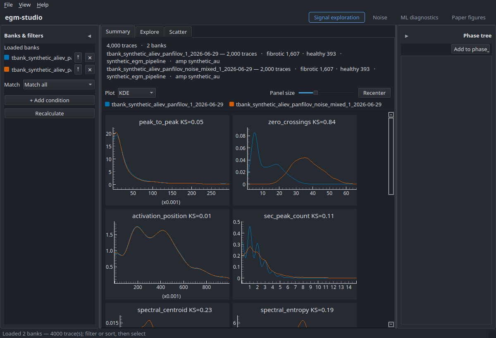</a>

**Explore** is the filter-and-sort workspace. Build a filter in the left rail
(**+ Add condition** — a feature, metadata field, or source, with a comparison), choose
**Match all** / **Match any**, and **Recalculate**. The result table lists the matching
traces; click a column header to sort.

<a href="screenshots/04-signal-explore.png">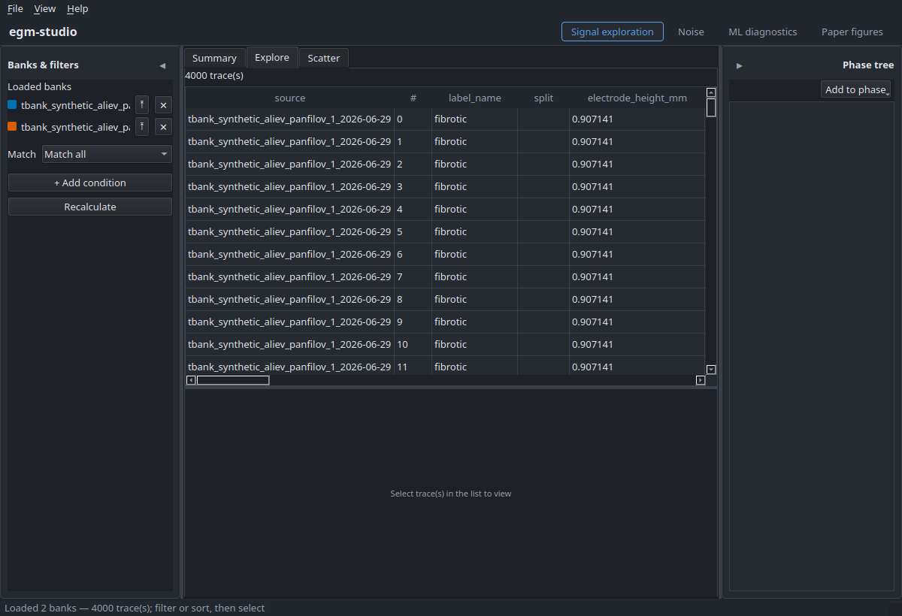</a>

**Click a row** to open the per-trace detail beneath the table: the EGM waveform on the
left, the trace's feature values and metadata on the right.

The detail is where you **compare a synthetic trace against real IAFDB data** — the main
way to build intuition for where the synthetic generator diverges from reality, which
then drives changes to synthetic-data generation. With a synthetic and an IAFDB bank both
loaded, pick a feature under **Find along**, then click **Find similar in other bank**:
the view pulls the nearest trace *in the other source* along that feature and shows the
two side by side, with the per-feature differences (Δ) annotated between them. Reading the
overlaid waveforms and the feature deltas together tells you what a "close" match still
gets wrong — a fatter activation, a noisier baseline, a shifted dominant frequency — so
you know what to tune in the simulator. Right-clicking a result row runs the same find
without leaving the table.

<a href="screenshots/05-signal-detail.png">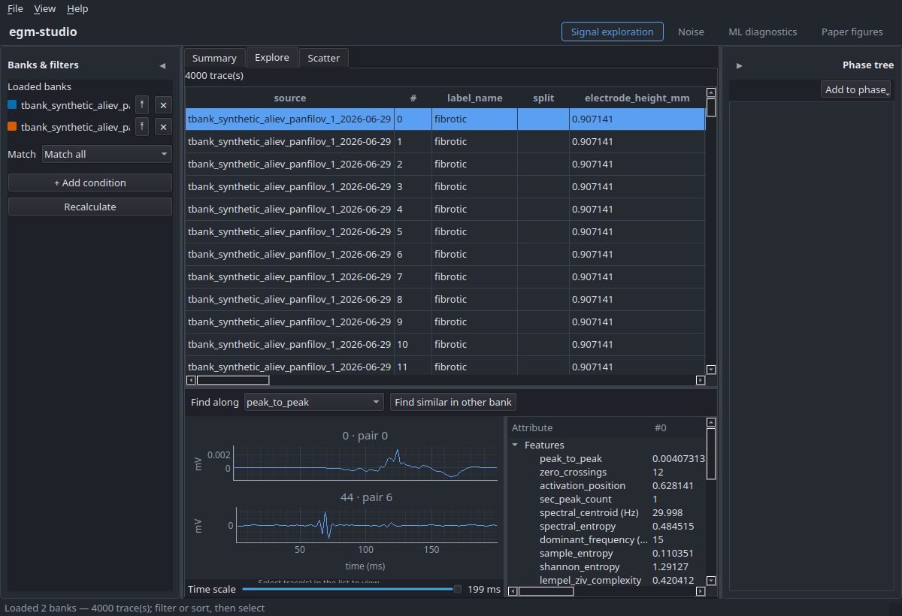</a>

**Scatter** plots any two features against each other for the current result, one point
per trace, coloured by source — useful for seeing how sources separate (or don't) in a
2-D feature slice. Click a point to jump to that trace's detail. On very large results,
tick **Decimate** to sub-sample the points for a responsive plot.

<a href="screenshots/06-signal-scatter.png">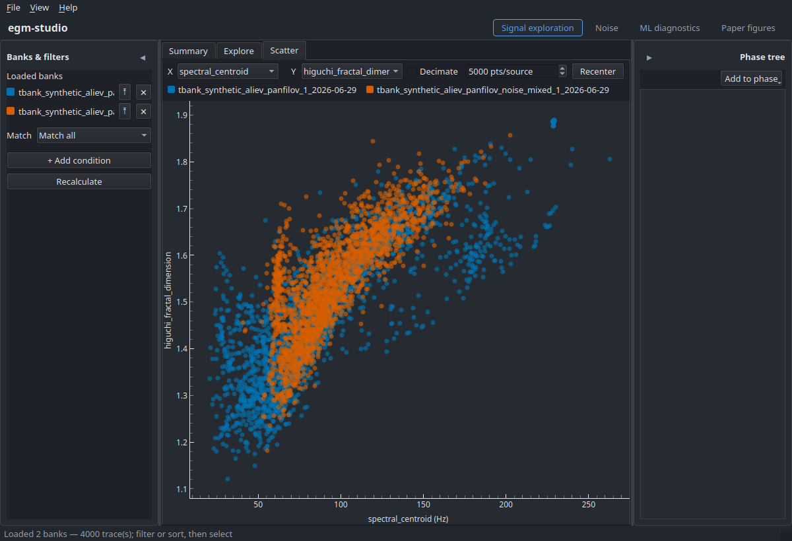</a>

### 3.2 Noise

**What it's for:** browse the raw IAFDB noise segments inside a noise bank. A noise bank
is raw segments (not the loaded-bank view-model the other modes operate on), so it gets
its own top-level mode.

Open one from the Phase tree (right-click a noise bank ▸ **View noise segments**) or via
**File ▸ Open noise bank**. The left rail shows the bank overview, **Record** and
**Channel** filters, and the segment table; selecting a segment plots it in the main
area. The plot is aspect-capped, so a single short segment reads as a signal band rather
than a stretched line.

<a href="screenshots/07-noise-mode.png">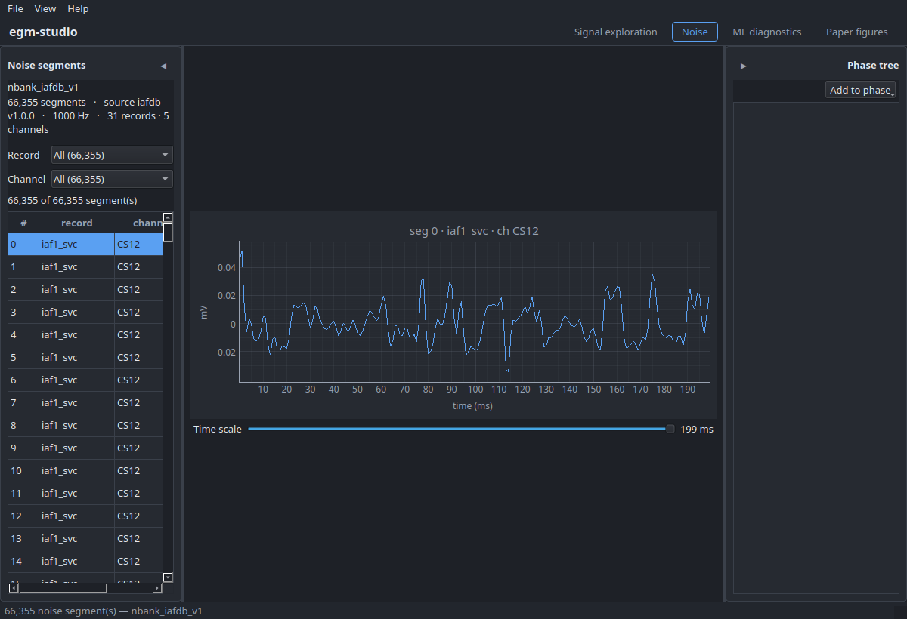</a>

### 3.3 ML diagnostics

**What it's for:** compare model runs over an evaluated predictions bank. Four tabs:
**Output · Metrics · Training · Explore.** The mode populates automatically when a bank
you open carries predictions — there's no separate "load evaluated bank" step. Open a
second predictions bank (or training run) to compare runs side by side.

**Output** overlays each run's P(positive) histogram, one series per source — the first
read on whether a model's outputs are well-spread or piled up at 0/1.

<a href="screenshots/08-ml-output.png">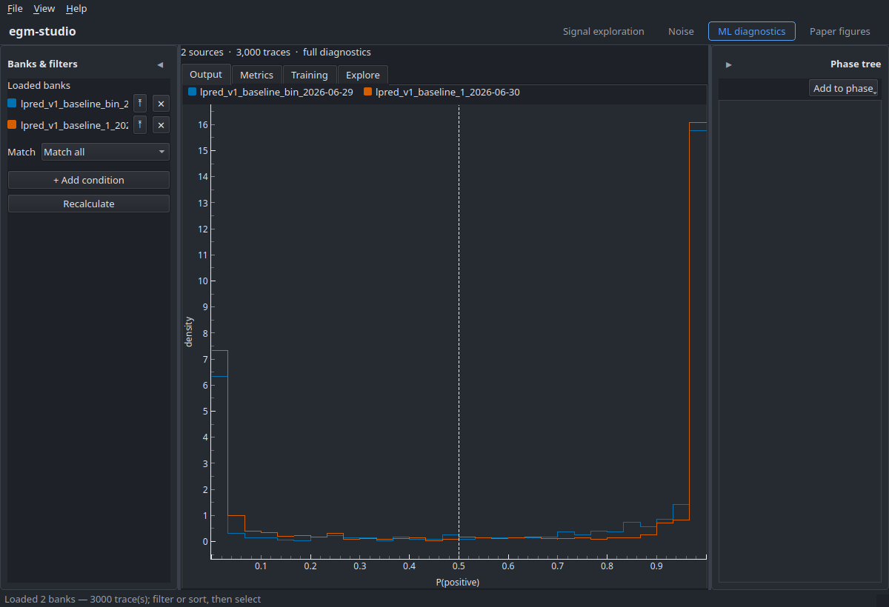</a>

**Metrics** is the full evaluation suite — ROC (with AUROC), a reliability/calibration
diagram (with ECE), and a confusion matrix per run. It appears **only when the bank
carries truth labels**; on an unlabeled bank (the IAFDB case) the mode stays
qualitative — Output + Explore only, no metrics — because there's no ground truth to
score against.

<a href="screenshots/09-ml-metrics.png">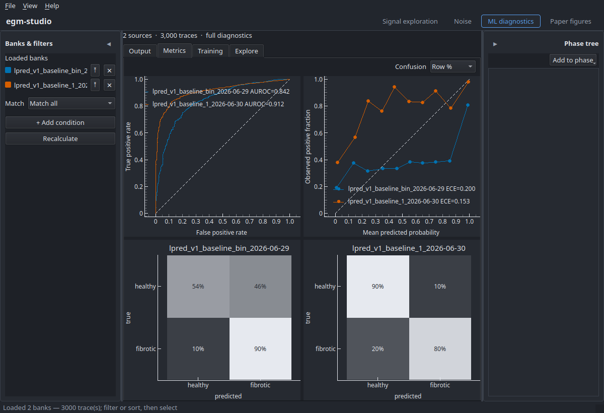</a>

**Training** draws the loss and selection-metric curves versus epoch for each loaded
run (train vs. val), for a quick "did training complete cleanly, and how do runs
compare" check.

<a href="screenshots/10-ml-training.png">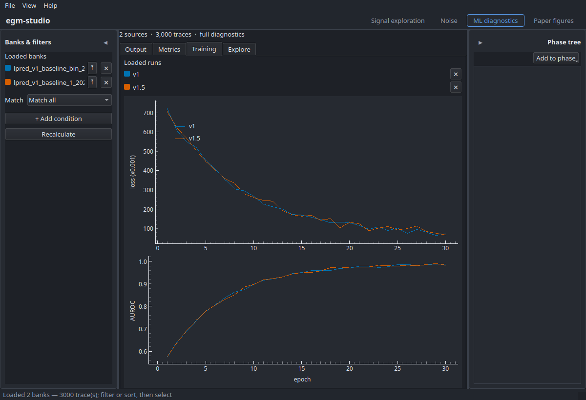</a>

**Explore** is the same filter-and-detail workspace as Signal exploration, but its job
here is to **understand why the model misclassifies**. Filter the result table to the
failure cases — add a `correctness_bucket == FP` / `== FN` condition with **Match any** —
then select a failure and click **Find nearest correct** in the detail: the view pulls the
closest *correctly-classified* trace of the opposite outcome and shows the pair with their
feature deltas. Comparing the two — waveform shape, the features that differ most, each
one's predicted probability — is how you form a hypothesis for the error (say, the model
keys on peak-to-peak and this false positive is just high-amplitude noise). **Find
in-class peers** instead pulls similar traces the model got *right*, to tell whether a
failure is a lone outlier or part of a systematic gap.

<a href="screenshots/11-ml-explore.png">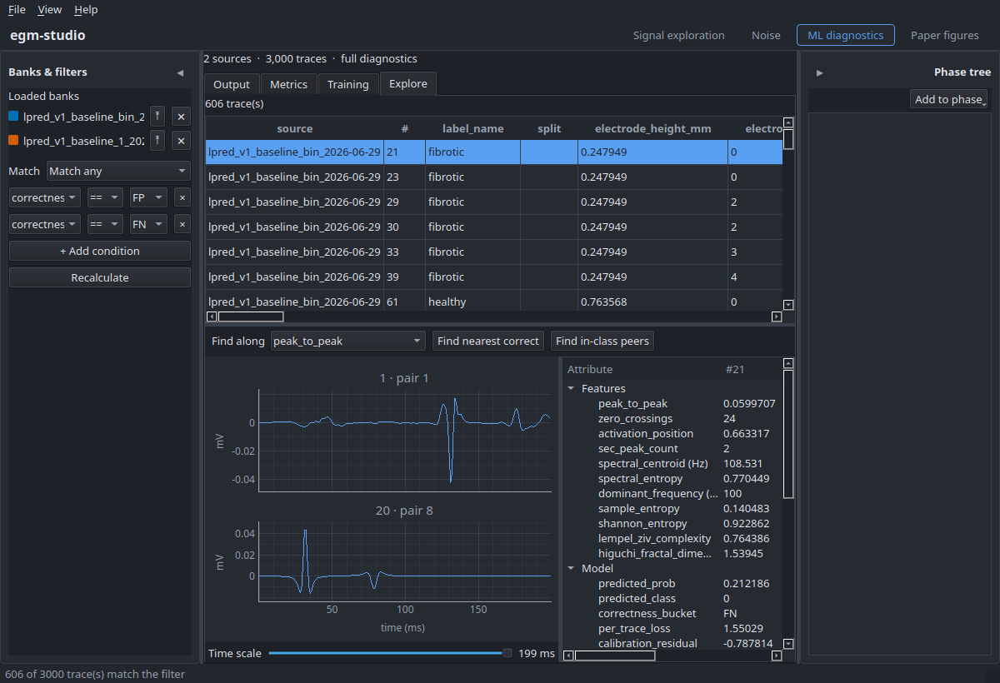</a>

### 3.4 Paper-figure prep

**What it's for:** compose a publication figure from a spec, with a live preview, then
render it. The view is a split: the curated spec form on the left, the live preview on
the right.

Pick a recipe, fill the form (the data-source groups, the feature subset, the styling),
and the preview re-renders. The preview is a **raster of the real matplotlib recipe** —
the exact same drawing code the export uses — so **what you see is what you'll get**.
Edits debounce; expensive recipes gate behind **Refresh preview**. **Render full** writes
the figure to the spec's own `output.path`.

<a href="screenshots/12-figure-prep.png">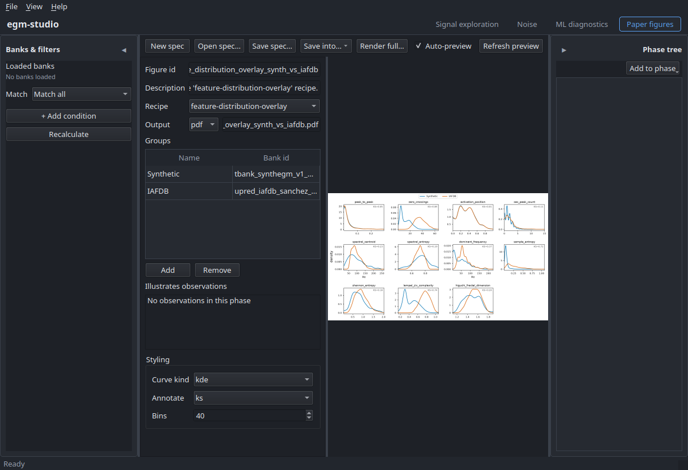</a>

The Phase tree drives a figure's lifecycle once its spec is saved into a phase:
**Generate** / **Regenerate** the image and **View figure**, with the menu adapting to
whether the rendered image already exists. Reproduce any figure outside the GUI with the
`egm-studio-render` CLI (§6).

---

## 4. Reading each figure

_Covers: how to interpret each of the eight paper-figure recipes — what it shows, and
how to tell a good result from a bad one. The **math** behind each lives in
[theory.md](theory.md); this section is the visual-interpretation half._

For each recipe: **what it shows · how to read it · good vs. bad.** Example renders can
be generated with `egm-studio-render <spec>.json` (these are figure outputs, not GUI
screenshots).

**prediction-histogram** — the distribution of the model's P(positive) output over a
bank, one overlaid series per source or run. It's the fastest read on whether a model
*separates* the classes: a healthy binary model pushes probability toward 0 and toward 1,
so a good histogram is **bimodal** — one hump of negatives near 0, one of positives near
1. **Watch for** a single spike, especially everything jammed against one edge (the
Phase-1 saturation failure, where the model emits a near-constant probability regardless
of input), or a broad featureless smear (the model isn't committing). On an unlabeled
bank you can't colour by truth, but the *shape* alone still shows whether the model
collapsed. _(Math: histograms / KDE, [theory.md](theory.md) §1.4–1.5.)_

| Good — bimodal, confident | Watch for — saturated / collapsed |
|---|---|
| <a href="screenshots/figures/prediction-histogram-good.png">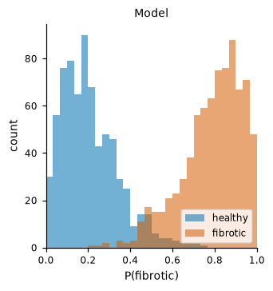</a> | <a href="screenshots/figures/prediction-histogram-bad.png">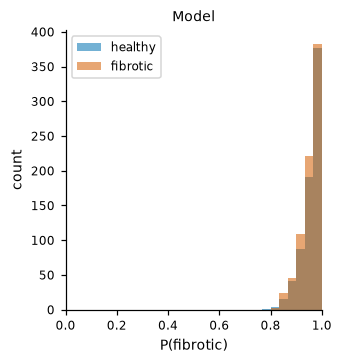</a> |

**feature-distribution-overlay** — one small-multiple panel per egm-features feature, each
overlaying that feature's distribution across two or more banks (typically synthetic vs.
IAFDB), with the pairwise KS distance in the panel title. This is the sim-realism
diagnostic: where do the synthetic feature distributions match real recordings, and where
do they diverge? **Good:** curves that sit on top of each other with small KS values — the
synthetic side reproduces that feature. **Watch for** panels where the curves pull apart
(large KS) or a synthetic distribution that's much narrower or shifted relative to real —
those are the features to target in the next round of synthetic-data generation. _(Math:
KS distance [theory.md](theory.md) §1.2, KDE §1.5.)_

| Good — curves overlap (small KS) | Watch for — curves diverge (large KS) |
|---|---|
| <a href="screenshots/figures/feature-distribution-overlay-good.png">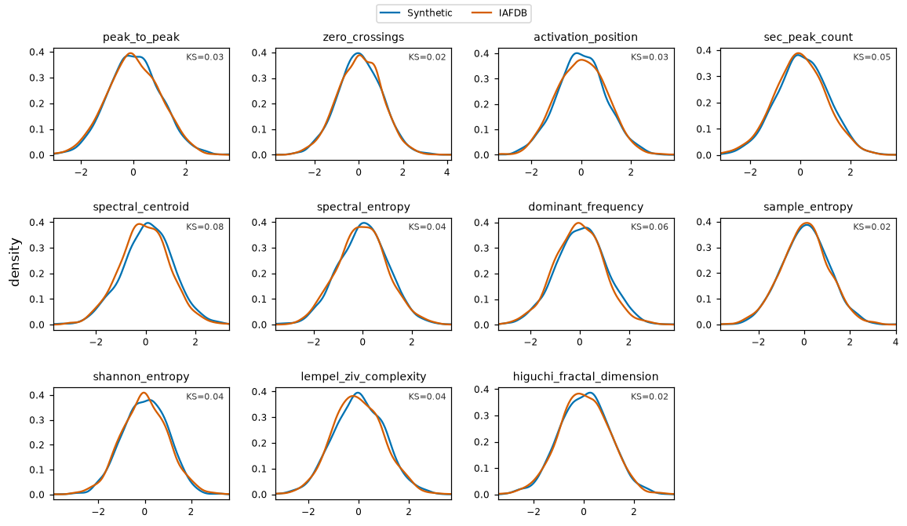</a> | <a href="screenshots/figures/feature-distribution-overlay-bad.png">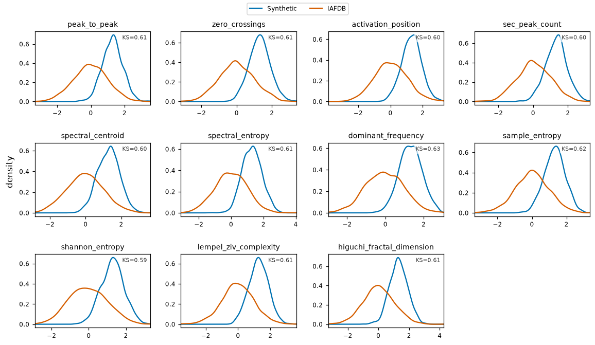</a> |

**bar-chart-with-deltas** — one bar per feature giving that feature's distance (KS or
Wasserstein) from a reference bank, with a delta marker showing the change versus a
baseline. It condenses the overlay above into a single "how far is each feature from real,
and did my change help?" view. **Good:** short bars (close to real) with deltas pointing
toward zero (the intervention narrowed the gap). **Watch for** deltas pointing the wrong
way — a change that helped some features but regressed others. _(Math: per-feature
distances + roll-up, [theory.md](theory.md) §2; KS / Wasserstein §1.2–1.3.)_

| Good — short bars (close to real) | Watch for — tall bars (far from real) |
|---|---|
| <a href="screenshots/figures/bar-chart-with-deltas-good.png">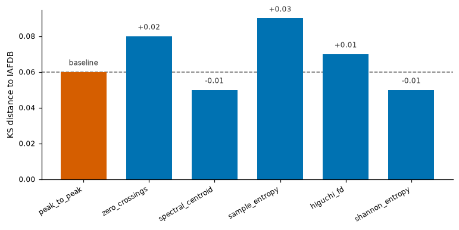</a> | <a href="screenshots/figures/bar-chart-with-deltas-bad.png">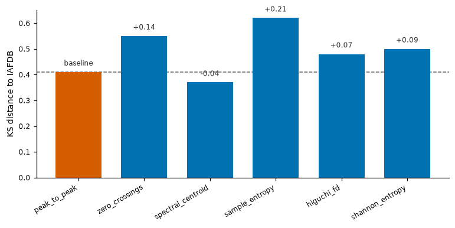</a> |

**roc-curve-multi-line** — the ROC curve (true-positive rate vs. false-positive rate as
the decision threshold sweeps) for one or more runs, each run's AUROC in the legend.
**Good:** a curve that bows toward the top-left corner and an AUROC near 1.0 — the model
ranks positives above negatives. **Watch for** a curve hugging the diagonal (AUROC ≈ 0.5,
no better than chance). Compare runs by which curve sits consistently above the other.
Only meaningful on a *labelled* bank. _(Math: ROC [theory.md](theory.md) §4.1, AUROC
§4.2.)_

| Good — bows to top-left, AUROC ≈ 1 | Watch for — hugs the diagonal (≈ 0.5) |
|---|---|
| <a href="screenshots/figures/roc-curve-multi-line-good.png">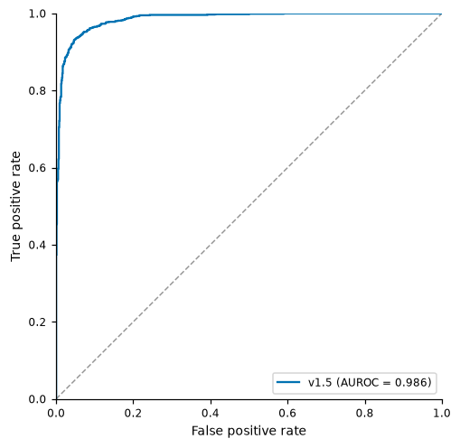</a> | <a href="screenshots/figures/roc-curve-multi-line-bad.png">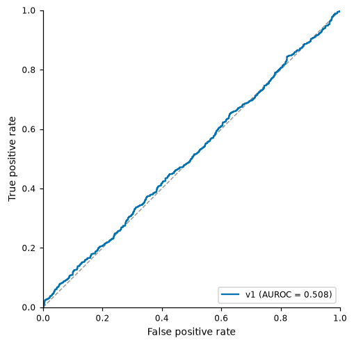</a> |

**calibration-reliability-diagram** — predicted probability (x) vs. the observed positive
fraction (y) within each probability bin, per run, with each run's Expected Calibration
Error (ECE) annotated. It answers "when the model says 0.8, is it right about 80% of the
time?" **Good:** points on the diagonal and a low ECE — the probabilities mean what they
say. **Watch for** points below the diagonal (over-confident — the model claims more
certainty than it earns) or above it (under-confident); a high ECE flags that the outputs
need recalibrating before you trust them as probabilities. _(Math: reliability curve +
ECE, [theory.md](theory.md) §4.3.)_

| Good — on the diagonal, low ECE | Watch for — sags below (over-confident) |
|---|---|
| <a href="screenshots/figures/calibration-reliability-diagram-good.png">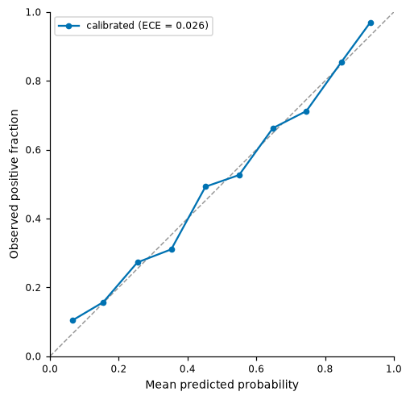</a> | <a href="screenshots/figures/calibration-reliability-diagram-bad.png">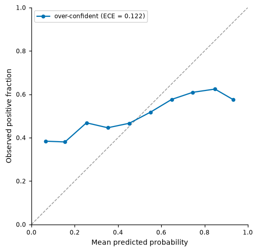</a> |

**trace-pair-gallery** — a grid of matched trace pairs, each a query trace beside its
nearest neighbour in another bank along a chosen feature, with the waveforms overlaid and
the per-feature deltas listed. It's the qualitative companion to the distribution figures:
it shows what "similar" actually looks like at the waveform level. **Good:** pairs whose
morphology genuinely resembles each other. **Watch for** pairs that match on the chosen
feature but look obviously different (a fat vs. a sharp activation, a clean vs. a noisy
baseline) — a sign that single-feature similarity is missing something the eye catches.
_(Math: per-feature similarity, [theory.md](theory.md) §3.)_

| Good — pairs genuinely resemble | Watch for — matched but visibly different |
|---|---|
| <a href="screenshots/figures/trace-pair-gallery-good.png">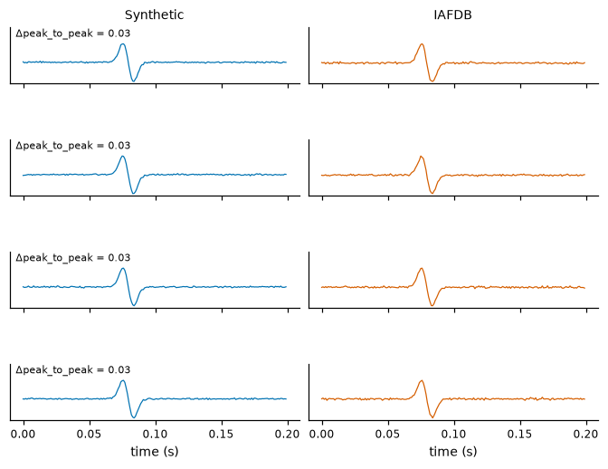</a> | <a href="screenshots/figures/trace-pair-gallery-bad.png">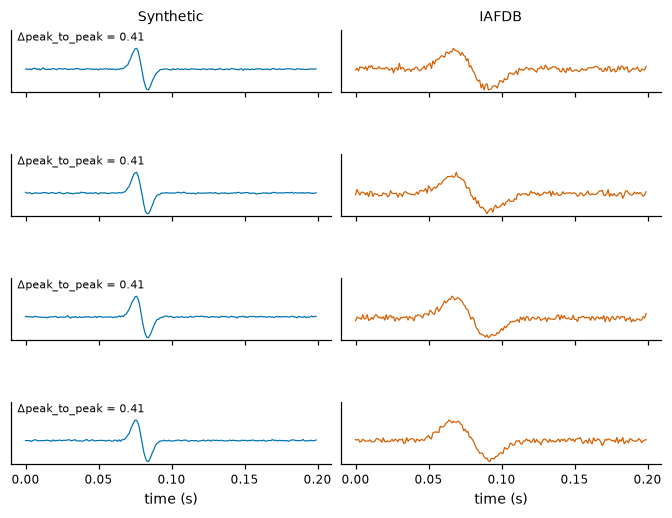</a> |

**summary-table** — a rendered table of the numbers behind a phase: e.g. a noise-bank
curation summary (segments kept / dropped per record and channel) or a per-run metrics
roll-up. There's no curve to read — it's the figure form of the tabular facts a paper
needs, generated from the data rather than transcribed by hand. **Read** the cells; that's
the point. _(No distribution math; it renders values as-is.)_

<a href="screenshots/figures/summary-table-example.png">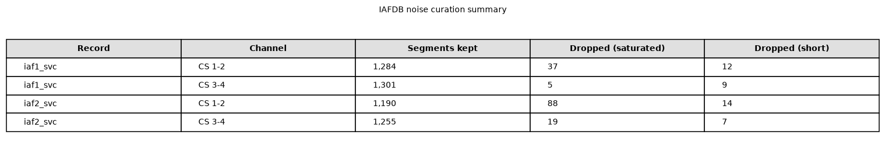</a>

**training-curve** — loss and the selection metric (e.g. AUROC) versus epoch, with the
train and validation series drawn separately and the best epoch marked. **Good:** both
losses fall and flatten, the validation series tracks the training one, and the metric
rises to a plateau. **Watch for** validation loss turning back up while training loss keeps
falling (overfitting — the marked best epoch is where to stop), or a loss that never
really drops (nothing is being learned). _(Standard train / val curves; no distribution
math.)_

| Good — val tracks train, metric plateaus | Watch for — val turns up (overfitting) |
|---|---|
| <a href="screenshots/figures/training-curve-good.png">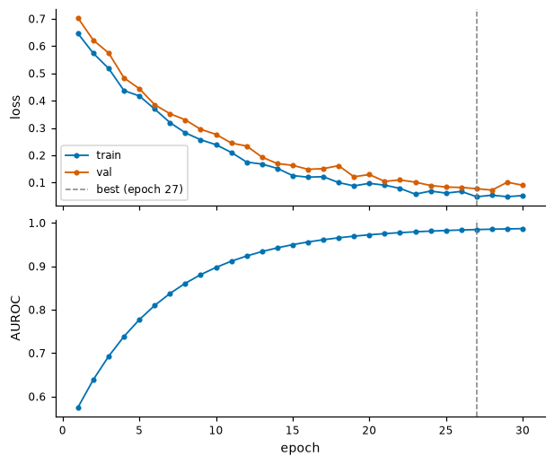</a> | <a href="screenshots/figures/training-curve-bad.png">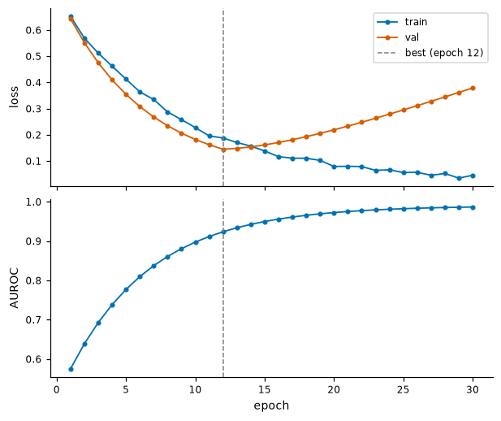</a> |

---

## 5. Saving your work

egm-studio v0.1 has no generic "save session," but it does persist the meaningful
things — the observations you write and the figures you compose — into the phase-
organized meta repo. This section is the screenshot tour; the full model (scratch,
promotion, dependency tracking) is in [saving_work.md](saving_work.md).

**Save an observation** (**File ▸ Save observation**) captures a finding: a title, the
required prose, optional "builds on" links to earlier observations, and — automatically
— a snapshot of the current **view state** (the loaded banks, the filter, and the
selection, shown along the bottom). Re-opening the observation later reloads that view,
not just the text.

<a href="screenshots/13-save-observation.png">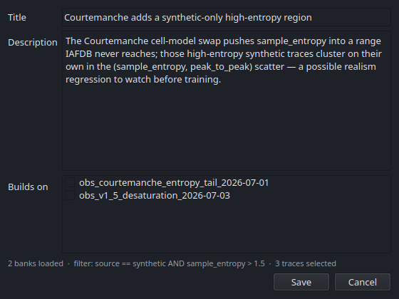</a>

**Save a figure** (Paper-figure prep ▸ **Save into…**) records the spec plus the banks,
models, and observations it draws on.

Both land in the **Phase tree** in the right rail — the artifact tree for the loaded
phase, grouped by role (banks, runs, models, observations, figures, papers) with a
status dot per artifact. If no phase is open, saves go to **scratch** (a per-user
mini-phase); **Promote to phase** moves them into a real phase later. **Add to phase** /
**Remove from phase** curate what the phase indexes.

<a href="screenshots/14-phase-tree.png">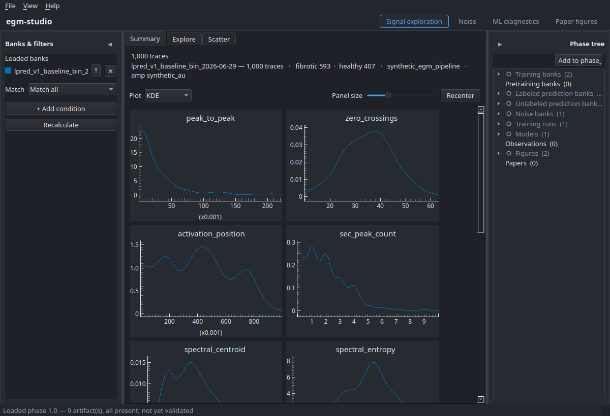</a>

---

## 6. Headless rendering (`egm-studio-render`)

_Covers: reproducing any figure from its spec, no GUI._ Every figure the app composes is
just a JSON spec plus the same drawing code the CLI runs, so any figure is reproducible
outside the app — in CI, on a headless box, or from a Makefile. The quickstart is in
[getting-started.md](getting-started.md#rendering-figures-from-the-cli); this is the
reference.

```bash
egm-studio-render SPEC.json [-o OUTPUT] [--phase FOLDER]
                            [--banks MAP.json] [--bank ID=PATH ...] [--overwrite]
```

### The spec

A figure spec is a small JSON document (schema `figure_spec`, versioned; egm-data owns the
parser — egm-studio never reads the JSON itself). A representative one:

```json
{
  "schema_version": "1",
  "id": "fig_prediction_histogram_synth_vs_iafdb",
  "description": "…what the figure shows and why…",
  "recipe": "prediction-histogram",
  "inputs": {
    "groups": [
      { "name": "Synthetic val", "bank_id": "lpred_synth_small_2026-06-27" },
      { "name": "IAFDB",         "bank_id": "upred_iafdb_sanchez_2026-06-27" }
    ]
  },
  "layout":  { "mode": "panels" },
  "styling": { "bins": 30, "density": false, "xlabel": "P(fibrotic)" },
  "output":  { "format": "pdf", "path": "out/fig_prediction_histogram.pdf" }
}
```

The fields: `recipe` names one of the eight recipes (§4); `inputs.groups` is the list of
series to draw; `layout` and `styling` are recipe-specific (panels vs. overlay, bin count,
KS annotation, …); `output` is where the image goes and in what format. Example specs for
every recipe live in [`examples/`](../examples/).

The important detail: **each group carries a `bank_id`, not a path.** The spec stays
portable — it references banks by their stable id and leaves resolving those ids to disk to
render time. That is the job of the next three flags.

### Resolving bank ids to files

Supply the `bank_id → path` mapping one of three ways; when the same id appears in more than
one, **later sources win** (so a `--bank` flag overrides a `--banks` file, which overrides
the `--phase` manifest):

- **`--phase FOLDER`** — point at a phase directory and its `manifest.json` resolves the
  ids. This is the normal path once a figure is saved into a phase; you render the phase's
  specs without naming a single file.
- **`--banks MAP.json`** — a hand-written `{ "bank_id": "path", … }` JSON. Copy
  [`examples/bank_paths.example.json`](../examples/bank_paths.example.json) to a local,
  git-ignored `banks.json` and fill in absolute paths for ad-hoc rendering.
- **`--bank ID=PATH`** — map a single id inline; repeatable. Handy for overriding one bank
  of an otherwise phase-resolved spec.

With no mapping and a spec that needs data, the CLI stops and tells you to pass one
(exit 4).

### Skipping, overwriting, exit codes

An already-rendered output is **skipped** (exit 0) *before* any data is loaded, so
re-running a phase's specs only renders what's missing. Pass `--overwrite` to force a
re-render. `-o/--output` overrides the spec's `output.path`.

The exit code says exactly what happened — useful in a build script:

| Code | Meaning |
|---|---|
| 0 | Rendered — or the output already existed and was skipped |
| 1 | File or render error (bad output path, drawing failure) |
| 2 | Invalid spec (malformed JSON or schema mismatch) |
| 3 | Unknown recipe name |
| 4 | No figure data available (no id→path mapping, or the recipe has no loader) |
| 5 | Figure-data loading failed (bad path, unreadable bank, or an unmapped id) |

---

## 7. Navigation

_Covers: how to drive the app from the keyboard/mouse._

egm-studio v0.1 deliberately defines **no custom keyboard shortcuts.** Everything is
driven by menus (with the standard OS accelerators) and by the built-in mouse navigation
of the pyqtgraph plots. A curated shortcut set is a candidate for a later version; until
then this is the whole story.

**Plot navigation** — every interactive plot (the trace views, the feature-distribution
grid, the scatter, the metric charts) shares pyqtgraph's mouse model:

| Action | Does |
|---|---|
| Left-drag | Pan the view |
| Scroll wheel | Zoom both axes about the cursor |
| Right-drag | Zoom — drag horizontally to scale X, vertically to scale Y |
| Right-click | Context menu: **View All** (auto-range), per-axis options, **Export…** |

**Trace views** additionally carry a **time-scale slider** bound to the shared X range:
drag it to set how many milliseconds are on screen, so a set of stacked traces stays
aligned on a common window (the stack compares selected traces by window-relative time,
not wall-clock simultaneity).

**Selection** is mouse-driven throughout: click a row in a result list (Ctrl/Shift for
multi-select up to the 3-pane compare cap), or click a point in the scatter to select and
reveal that trace in the detail.

---

## 8. Troubleshooting / FAQ

_Covers: the handful of things that trip people up._

**The app won't start on Linux (Qt libraries).** PySide6 needs a few system libraries that
aren't Python packages — `libegl1 libgl1 libxkbcommon0 libdbus-1-3`. Install them (see
[getting-started.md](getting-started.md#prerequisites)); a missing one usually shows up as
an `xcb` / `libEGL` load error at launch.

**No display / headless box.** Figures render without any display — that's what the CLI
(§6) is for. To run the *GUI* itself where there's no X server (CI, a container), set
`QT_QPA_PLATFORM=offscreen`; that's how the test suite and the screenshot harness drive it.

**A large bank is slow the first time.** The cost is feature extraction, and it only
happens once: the tiered cache (in-memory, then on-disk) makes every re-open fast. The
memory ceiling and a **Flush cache** action live in **Settings**. A big load also shows a
progress dialog you can cancel.

**I opened a bank but ML diagnostics is empty.** Flow B needs *predictions*. Only an
evaluated bank (one the classifier has scored) feeds the Output / Metrics / Explore tabs; a
plain signal bank has nothing to diagnose. Open a `*_pred` bank instead.

**The Metrics tab says the set is unlabelled.** ROC, calibration, and the confusion matrix
all need truth labels, which an in-vivo IAFDB eval set doesn't have (there is no fibrosis
ground truth for real recordings). The Output distribution and Explore still work — you
just get the qualitative half. This is expected, not a bug.

**The figure preview is blank in Paper-figure prep.** The preview resolves its data on a
background thread — on a first render or after switching banks it can take a moment. Give it
a second; expensive recipes gate behind **Refresh preview** rather than re-rendering on
every keystroke. If it stays blank, the spec's bank ids probably aren't mapped — set the
bank paths for the preview (the same id→path resolution the CLI does).

**A figure won't render from the CLI / an id won't resolve.** The exit code says which
half failed (§6): **4** means no id→path mapping was supplied (pass `--phase`,
`--banks`, or `--bank`), **5** means a mapping was supplied but a bank couldn't be loaded
(bad path, unreadable file, or a `bank_id` in the spec that nothing mapped). **2** / **3**
are a malformed spec or an unknown recipe name.

**An artifact shows amber in the Phase tree.** Amber means "indexed but its dependencies
don't fully resolve in this scope" — e.g. a figure that references a bank which isn't in
the current phase (or scratch). Add the missing artifact to the phase, or promote its
dependency closure along with it (**Settings** has an auto-add-dependencies toggle). A red
dot instead means the artifact's own file is missing on disk.

---

## Where to go next

- [getting-started.md](getting-started.md) — install, run, test, the dev loop.
- [saving_work.md](saving_work.md) — the save / phase / scratch model.
- [theory.md](theory.md) — the math behind the figures.
- [../project/architecture.md](../project/architecture.md) — how the app is built.
